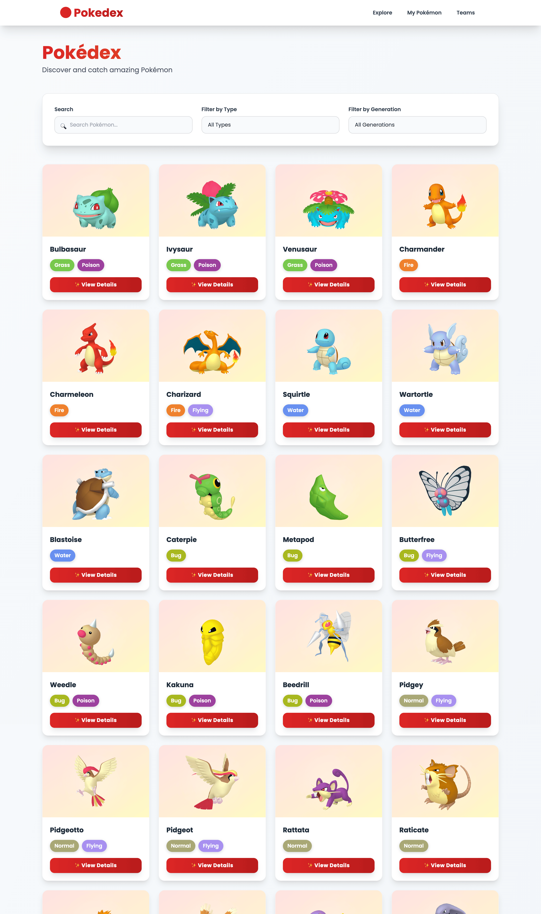
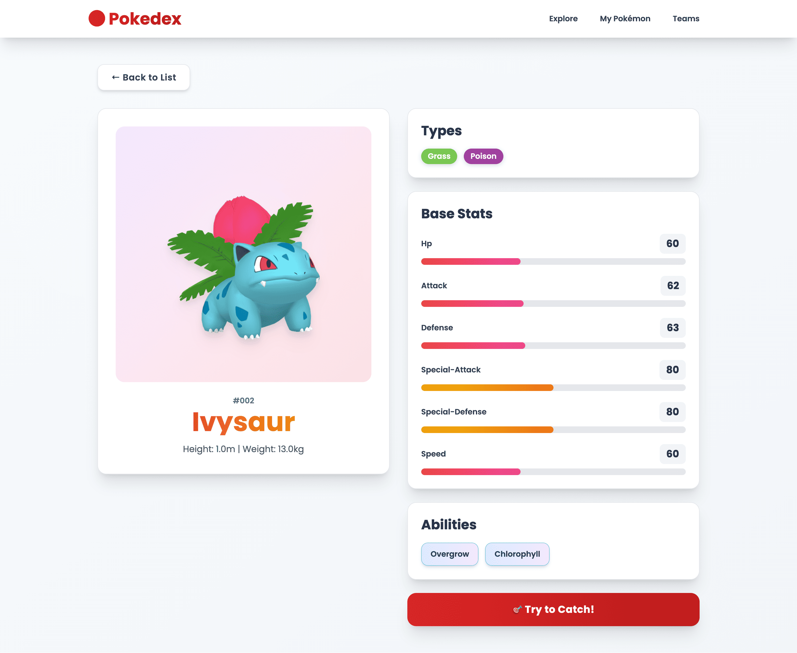
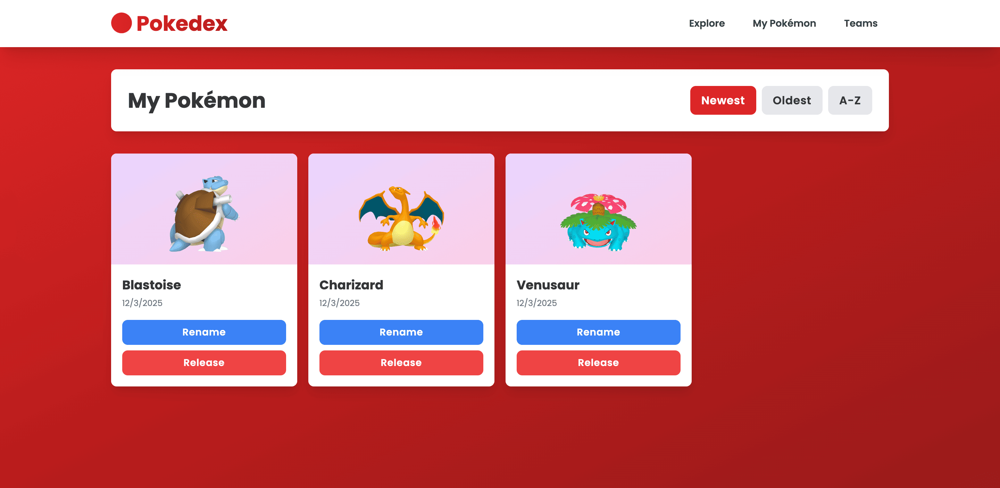
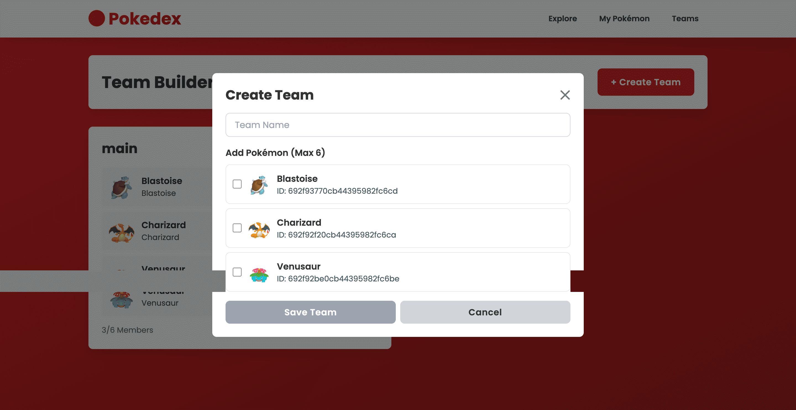

# Pokedex Explorer

A full-stack **MERN application** (MongoDB, Express, React, Node.js) for exploring, catching, and managing Pokémon. Build teams, rename your catches, and explore the Pokédex using real data from PokéAPI!

## 📸 Screenshots

### Pokémon Explorer

*Browse all Pokémon with search, filter by type, and pagination*

### Catch System

*Catch Pokémon with 50% success rate and nickname them instantly*

### My Pokémon Collection

*View, rename, and release your caught Pokémon with sorting options*

### Team Builder

*Build teams with up to 6 Pokémon from your collection*

### Mobile Responsive Design

*Fully responsive design works seamlessly on all screen sizes*

**📁 To add screenshots:**
1. Create a `docs/screenshots/` folder in your project root
2. Add PNG files: `pokemon-list.png`, `catch-pokemon.png`, `my-pokemon.png`, `team-builder.png`, `mobile-responsive.png`
3. The images will automatically display in this README

---

## 🎮 Features

### Pokémon Exploration
- Browse all Pokémon with pagination
- **Search** by name
- **Filter** by type (17 types with custom colors)
- 3D Pokémon sprites from official artwork (PokéAPI home sprites)
- Access detailed Pokémon stats and abilities
- Responsive grid layout (1-4 columns based on screen size)

### Catch System
- No authentication required - unique **clientId** stored in localStorage
- Catch Pokémon with **50% success chance**
- Give your caught Pokémon nicknames
- View caught date and rename anytime
- Release Pokémon back to the wild

### My Pokémon Page
- List all caught Pokémon
- **Rename** Pokémon with nicknames
- **Release** (delete) Pokémon
- **Sorting**: Newest, Oldest, Alphabetical
- Responsive card layout

### Team Builder
- Create multiple teams
- Add up to **6 Pokémon per team**
- Organize teams by creation date
- **Edit** and **Delete** teams
- Only use caught Pokémon in teams

### Data Persistence
- MongoDB database for caught Pokémon
- MongoDB database for teams
- Client ID stored in localStorage
- Persistent across sessions

## 🚀 Live Demo & Deployment

### Run Locally (Recommended)
```bash
# Clone the repository
git clone <your-repo-url>
cd pokemon

# Start backend
cd server && npm install && npm run dev

# In a new terminal, start frontend
cd client && npm install && npm run dev

# Open http://localhost:5173 in your browser
```

### Deploy to Production
- **Backend:** Deploy to Heroku, Railway, or Render
- **Frontend:** Deploy to Vercel, Netlify, or GitHub Pages
- **Database:** MongoDB Atlas (free tier available)

---

## 🏗️ Project Structure

```
pokemon/
├── server/                 # Express.js backend
│   ├── src/
│   │   ├── models/        # Mongoose schemas
│   │   ├── routes/        # API endpoints
│   │   ├── middleware/    # CORS, error handling
│   │   ├── utils/         # Cache, PokéAPI helpers
│   │   └── server.js      # Main server file
│   ├── package.json
│   └── .env.example
│
└── client/                 # React + Vite frontend
    ├── src/
    │   ├── api/           # Axios API client
    │   ├── components/    # React components
    │   ├── pages/         # Page components
    │   ├── stores/        # Zustand stores (3)
    │   ├── styles/        # TailwindCSS styles
    │   ├── utils/         # Helper functions
    │   ├── App.jsx        # React Router setup
    │   └── main.jsx       # React entry point
    ├── index.html
    ├── package.json
    └── vite.config.js
```

## 🚀 Quick Start

### Prerequisites

- Node.js (v14+)
- MongoDB (local or Atlas)
- npm or pnpm

### Backend Setup

1. Navigate to the server directory:
```bash
cd server
```

2. Install dependencies:
```bash
npm install
```

3. Create `.env` file:
```bash
cp .env.example .env
```

4. Update `.env` with your MongoDB URI:
```env
PORT=5000
MONGODB_URI=mongodb://localhost:27017/pokedex-explorer
NODE_ENV=development
```

5. Start the backend:
```bash
npm run dev
```

The backend will run on `http://localhost:5000`

### Frontend Setup

1. Navigate to the client directory:
```bash
cd client
```

2. Install dependencies:
```bash
npm install
```

3. Start the frontend:
```bash
npm run dev
```

The frontend will run on `http://localhost:5173`

## 🔌 API Routes

### Pokémon
- `GET /api/pokemon?limit=20&offset=0` - Get paginated Pokémon list
- `GET /api/pokemon/:id` - Get Pokémon details with evolution chain

### Caught Pokémon
- `GET /api/caught?clientId=xxx` - Get all caught Pokémon for a client
- `POST /api/caught` - Create a new caught Pokémon record
- `PUT /api/caught/:id` - Update caught Pokémon (rename)
- `DELETE /api/caught/:id` - Release a caught Pokémon

### Teams
- `GET /api/teams?clientId=xxx` - Get all teams for a client
- `POST /api/teams` - Create a new team
- `PUT /api/teams/:id` - Update a team
- `DELETE /api/teams/:id` - Delete a team

## 🎨 Tech Stack

### Backend
- **Express.js** - Web framework
- **Mongoose** - MongoDB ODM
- **Axios** - HTTP client for PokéAPI
- **CORS** - Cross-origin resource sharing
- **Dotenv** - Environment configuration

### Frontend
- **React** - JavaScript UI library
- **Vite** - Build tool and dev server
- **React Router** - Client-side routing (v6)
- **TailwindCSS** - Utility-first CSS framework
- **Zustand** - Lightweight state management
- **Axios** - HTTP client

## 🌐 External APIs

- **PokéAPI** (https://pokeapi.co) - All Pokémon data
  - Sprites from `sprites.other.home.front_default` (3D images)
  - Stats, abilities, types, evolution chains

## 📝 Database Schema

### CaughtPokemon
```javascript
{
  clientId: String,
  pokemonId: Number,
  pokemonName: String,
  nickname: String,
  imageUrl: String,
  caughtAt: Date,
  timestamps: true
}
```

### Team
```javascript
{
  clientId: String,
  teamName: String,
  members: [{
    caughtPokemonId: ObjectId,
    nickname: String,
    pokemonName: String,
    imageUrl: String
  }],
  createdAt: Date,
  updatedAt: Date,
  timestamps: true
}
```

## 🔐 No Authentication

This app uses a simple client ID system stored in localStorage. No login required!

The client ID is generated on first visit:
```javascript
clientId = `client_${Date.now()}_${Math.random().toString(36).substr(2, 9)}`
```

## 🎨 Pokémon Type Colors

All 17 Pokémon types have unique colors:
- Fire (#F08030), Water (#6890F0), Grass (#78C850), Electric (#F8D030)
- Ice (#98D8D8), Fighting (#C03028), Poison (#A040A0), Ground (#E0C068)
- Flying (#A890F0), Psychic (#F85888), Bug (#A8B820), Rock (#B8A038)
- Ghost (#705898), Dragon (#7038F8), Dark (#705848), Steel (#B8B8D0)
- Fairy (#EE99AC)

## 📱 Responsive Design

- **Mobile**: 1-column grid
- **Tablet (sm)**: 2-column grid
- **Desktop (md)**: 3-column grid
- **Large (lg)**: 4-column grid

All components are mobile-first and fully responsive!

## 📊 State Management (Zustand)

### 3 Global Stores
1. **pokemonStore** - Pokemon list and details
2. **caughtStore** - User's caught Pokémon + sorting
3. **teamStore** - User's teams

All stores are **centralized** with **clean actions** and **proper error handling**.

## 🎯 Future Enhancements

- [ ] Drag & drop team reordering
- [ ] Evolution chain visualization
- [ ] Pokémon comparison tool
- [ ] Type advantage calculator
- [ ] Trading system
- [ ] Leaderboard
- [ ] Dark mode
- [ ] Mobile app

## 📄 License

MIT

## 👨‍💻 Contributing

Feel free to fork and create pull requests for any improvements!

---

**Happy Pokémon catching!** 🎮✨

## 🏗️ Project Structure

```
pokemon/
├── server/                 # Express.js backend
│   ├── src/
│   │   ├── models/        # Mongoose schemas
│   │   ├── routes/        # API endpoints
│   │   ├── middleware/    # CORS, error handling
│   │   ├── utils/         # Cache, PokéAPI helpers
│   │   └── server.js      # Main server file
│   ├── package.json
│   └── .env.example
│
└── client/                 # React + Vite frontend
    ├── src/
    │   ├── api/           # API client
    │   ├── components/    # React components
    │   ├── pages/         # Page components
    │   ├── stores/        # Zustand stores
    │   ├── styles/        # CSS styles
    │   ├── utils/         # Helper functions
    │   ├── App.jsx        # Root component
    │   └── main.jsx       # Entry point
    ├── index.html
    ├── package.json
    └── vite.config.js
```

## 🚀 Quick Start

### Prerequisites

- Node.js (v14+)
- MongoDB (local or Atlas)
- npm or pnpm

### Backend Setup

1. Navigate to the server directory:
```bash
cd server
```

2. Install dependencies:
```bash
npm install
```

3. Create `.env` file:
```bash
cp .env.example .env
```

4. Update `.env` with your MongoDB URI:
```env
PORT=5000
MONGODB_URI=mongodb://localhost:27017/pokedex-explorer
NODE_ENV=development
```

5. Start the backend:
```bash
npm run dev
```

The backend will run on `http://localhost:5000`

### Frontend Setup

1. Navigate to the client directory:
```bash
cd client
```

2. Install dependencies:
```bash
npm install
```

3. Start the frontend:
```bash
npm run dev
```

The frontend will run on `http://localhost:5173`

## 🔌 API Routes

### Pokémon
- `GET /api/pokemon?limit=20&offset=0` - Get paginated Pokémon list
- `GET /api/pokemon/:id` - Get Pokémon details with evolution chain

### Caught Pokémon
- `GET /api/caught?clientId=xxx` - Get all caught Pokémon for a client
- `POST /api/caught` - Create a new caught Pokémon record
- `PUT /api/caught/:id` - Update caught Pokémon (rename)
- `DELETE /api/caught/:id` - Release a caught Pokémon

### Teams
- `GET /api/teams?clientId=xxx` - Get all teams for a client
- `POST /api/teams` - Create a new team
- `PUT /api/teams/:id` - Update a team
- `DELETE /api/teams/:id` - Delete a team

## 🎨 Tech Stack

### Backend
- **Express.js** - Web framework
- **Mongoose** - MongoDB ODM
- **Axios** - HTTP client for PokéAPI
- **CORS** - Cross-origin resource sharing
- **Dotenv** - Environment configuration

### Frontend
- **React** - JavaScript library
- **Vite** - Build tool and dev server
- **React Router** - Client-side routing
- **TailwindCSS** - Utility-first CSS
- **Zustand** - State management
- **Axios** - HTTP client

## 🌐 External APIs

- **PokéAPI** (https://pokeapi.co) - All Pokémon data
  - Sprites from `sprites.other.home.front_default`
  - Stats, abilities, types, evolution chains

## 📝 Database Schema

### CaughtPokemon
```javascript
{
  clientId: String,
  pokemonId: Number,
  pokemonName: String,
  nickname: String,
  imageUrl: String,
  caughtAt: Date,
  timestamps: true
}
```

### Team
```javascript
{
  clientId: String,
  teamName: String,
  members: [{
    caughtPokemonId: ObjectId,
    nickname: String,
    pokemonName: String,
    imageUrl: String
  }],
  createdAt: Date,
  updatedAt: Date,
  timestamps: true
}
```

## 🔒 No Authentication

This app uses a simple client ID system stored in localStorage. No login required!

The client ID is generated on first visit and stored locally:
```javascript
clientId = `client_${Date.now()}_${Math.random().toString(36).substr(2, 9)}`
```

## 🎯 Future Enhancements

- [ ] Drag & drop team reordering
- [ ] Evolution chain visualization
- [ ] Pokémon comparison tool
- [ ] Type advantage calculator
- [ ] Trading system
- [ ] Leaderboard
- [ ] Dark mode
- [ ] Mobile app

## 📄 License

MIT

## 👨‍💻 Contributing

Feel free to fork and create pull requests for any improvements!

---

**Happy Pokémon catching! 🎮**
